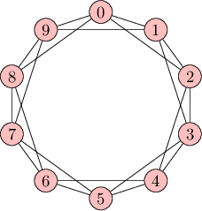

# ***cyclic**


An overview/wiki of esolangs can be found here: https://esolangs.org/wiki/Main_Page

(this project is on hiatus as I complete a mathematics research project that I have been working on for the past 6 months.)
*cyclic*: the functional, group-theoretical, cyclic group-based esoteric programming language.

[](https://packagist.org/packages/aimeos/aimeos-typo3)

In algebra, a  [cylic group](wikiedia.com/cyclic_group) or monogenous group is a group, denoted C_n that is generated by a single element.

**cylic** was an idea that originally stemmed from my writing of a mathematical paper concerning a set of equivalent mappings that is generated by the sum of two natural numbers. This purely mathematical inquiry was the precursor to my hypothesised computational model of this set's generation. After thinking about my mathematical paper's implications in computing, I posed a question to myself: "what does a programming language "based on" a finite cyclic group look like, and what are the idiosyncrasies that come with the constraints imposed by this premise?" 

This is when I decided to write a small esolang and compiler to accompany the grammar, thus **cyclic** was born.

This compiler, and programming language (syntax and semanstics), are still in their very early stages of development.


**Installation**
---

You may either build **cyclic** from source, or simply download the binary provided in this repository:

1.) To build **cyclic**
```bash
#Create build directory
mkdir cyclic
#Clone the repository
git clone https://www.github.com/algebraictype/cyclic
#Build the compiler (you may pass -nogtest to compile without Google Test)
make
```

2.) Download binary from releases tab

You will now have the **cyclic** compiler in the directory you created in the first step of the installation instructions.

**Usage**
---

```
USAGE: ./cyclic [OPTIONS]

  Esoteric group-theoretical programming language.
  Developed by *(d) -> (www.github.com/user/algebraictype)


OPTIONS:
  -program.cy  Write a program in cyclic that adheres to the language's grammar.
  -v           Display version and author information and exit.
  -help, -h    Show this message and exit.
```
